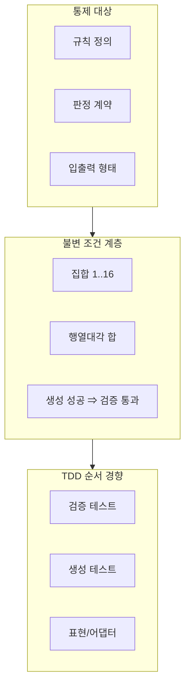

# 4x4 magic square problem definition
_Exported on 5/28/2026 at 14:05:47 GMT+9 from Cursor (3.5.38)_

---

**User**

당신은 문제 정의 전문가입니다.
나는 SW 아키텍트 입니다.
나는 4x4 Magic Square 프로그램을 만들려고 합니다.
하지만 바로 설계하거나 구현하지 마십시오.
먼저 문제 인식 단계부터 진행하십시오.
--------------------------------------------
STEP 1 — Observation (관찰)
--------------------------------------------
다음 질문에 답하십시오:
1. 현재 우리가 해결하려는 상황은 무엇인가?
2. 왜 4x4 마방진 문제를 다루는가?
3. 이 문제는 어떤 학습 또는 시스템 설계 맥락에서 등장하는가?
“마방진을 만든다”는 표현 대신,상황을 관찰 관점으로 서술하십시오.

---

**Cursor**

프로젝트 맥락을 파악하기 위해 워크스페이스를 먼저 살펴보겠습니다.

# STEP 1 — Observation (관찰)

워크스페이스(`MagicSquare_33`)에는 아직 코드·문서가 없습니다. 경로(`커서ai교육/dev`)로 보면, **새로 시작하는 학습·실습 과제**에 가깝습니다. 아래는 그 전제에서의 관찰입니다.

---

## 1. 현재 우리가 해결하려는 상황은 무엇인가?

**관찰:**  
한 사람(SW 아키텍트)이 **정해진 규칙을 만족하는 4×4 숫자 격자**를 얻고 싶어 하는데, 그 규칙이 무엇인지·어떻게 검증할지·어떤 형태로 결과를 보여줄지는 아직 명시되지 않았습니다.

구체적으로 보면:

- **입력·출력이 비어 있음** — 사용자가 숫자를 넣는지, 프로그램이 자동으로 채우는지, 화면/파일/콘솔 중 어디에 보여줄지 불명확합니다.
- **“맞는 격자”의 기준이 암묵적** — 행·열·대각선 합이 같다는 뜻은 일반적으로 알려져 있으나, 1~16을 한 번씩 쓰는지, 임의의 16개 수인지, 합이 34인지 등은 아직 관찰만으로는 확정되지 않습니다.
- **목적이 “한 번의 정답”인지 “과정 전체”인지 불명** — 한 격자만 필요한지, 생성·검증·탐색·설명까지 포함하는지도 아직 드러나지 않았습니다.

즉, 상황은 **“4×4 격자에 숫자를 배치했을 때, 여러 방향의 합(또는 다른 불변 조건)이 일치하는지를 다루는 소프트웨어를 만들려는 의도”**이고, 그 의도는 **빈 프로젝트 폴더와 교육용 경로**로만 현재 확인됩니다.

---

## 2. 왜 4×4 마방진 문제를 다루는가?

**관찰 (가능한 동기 — 확정이 아닌 가설):**

| 관찰 가능한 이유 | 설명 |
|------------------|------|
| **규모가 작고 규칙이 분명함** | 3×3보다 조건·해의 수가 늘어 “알고리즘 + 구조”를 연습하기 좋고, 5×5 이상보다 검증·시각화가 부담이 적음 |
| **아키텍트 관점의 연습 대상** | 단순 if/for가 아니라 **도메인 규칙(불변식), 생성 전략, 검증기, 표현(모델/뷰)** 를 나누는 연습에 적합 |
| **교육 맥락** | 폴더명이 교육·개발 실습을 시사 — 마방진 자체보다 **문제 정의 → 설계 → 구현** 흐름을 배우는 매개체일 수 있음 |
| **4×4의 특수성** | 짝수 차원 마방진은 홀수 차원(시아메스 등)과 **다른 성질·알려진 구성법**이 있어, “일반화된 마방진 엔진”과 구분되는 학습 포인트가 됨 |

**아직 관찰되지 않은 것:**  
비즈니스 요구(게임, 퍼즐 앱, 연구)인지, 개인 학습인지, 면접·과제 제출인지는 **코드·요구 문서 없이는 확인 불가**입니다.

---

## 3. 이 문제는 어떤 학습 또는 시스템 설계 맥락에서 등장하는가?

**관찰된 맥락:**

1. **학습 맥락 (강함)**  
   - 경로: `커서ai교육` / `dev` / `MagicSquare_33`  
   - 빈 저장소 → **요구를 스스로 정의하고 구현하는 실습**으로 보임  
   - AI 보조 개발(Cursor) 환경에서 **문제 인식 → 설계** 단계를 먼저 밟으려는 흐름(현재 대화가 그 증거)

2. **시스템 설계 맥락 (아키텍트 관점)**  
   - **제약 만족 문제(CSP)** 의 축소판: 16칸, 행·열·대각 합 등식  
   - **검증 서브시스템** vs **생성/탐색 서브시스템** 분리 연습  
   - **도메인 모델**(격자, 셀, 불변식)과 **애플리케이션**(UI, CLI, API) 경계 설정 연습  
   - 확장 가능성: 3×3, n×n, “유사 마방진”, 사용자 입력 검증 등으로 **범위가 커질 수 있는 경계**를 미리 인식하는 연습

3. **아직 맥락에 없는 것**  
   - 배포, 다중 사용자, 성능, 데이터 저장, 외부 연동 등 **운영·시스템 통합** 요구는 관찰되지 않음 → 초기에는 **단일 프로세스·로컬·교육용 단순 시스템** 가정이 자연스러움

---

## 관찰 관점 요약 (표현 전환)

| “만든다” 식 표현 | 관찰 식 표현 |
|------------------|--------------|
| 4×4 마방진 프로그램을 만든다 | **4×4 격자에 대한 합·배치 규칙을 정의하고, 그 규칙을 만족하는 배치를 얻거나 검증하는 소프트웨어를 도입하려는 상황** |
| 마방진을 생성한다 | **아직 정의되지 않은 입력·출력·성공 기준 하에서, “규칙에 맞는 격자”라는 결과물에 대한 기대가 존재함** |
| 문제를 푼다 | **교육·아키텍트 실습 맥락에서, 작지만 비자명한 제약 문제를 통해 요구 정의와 구조 분리를 연습하려는 의도** |

---

**다음 관찰 단계에서 채울 공백 (구현·설계 아님):**  
누가 쓰는지, 한 번만 쓰는지 반복하는지, “정답 하나”인지 “모든 해”인지, 1~16 고정인지, 실패 시 어떤 피드백을 원하는지 — 이들이 **STEP 2(문제 정의·이해관계자·성공 기준)** 로 넘어갈 때 관찰을 확정하는 질문이 됩니다.

원하시면 **STEP 2 — Problem framing(문제 프레이밍)** 에서 위 공백을 질문 목록으로만 정리하겠습니다. (여전히 설계·구현 없이 진행합니다.)

---

**User**

--------------------------------------------
STEP 2 — Why #1
--------------------------------------------
Q: 왜 마방진을 완성해야 하는가?
A를 가정하여 답하고, 그 답에서 드러나는 불편함 또는 구조적 문제를 분석하십시오.

---

**Cursor**

# STEP 2 — Why #1

## 가정한 답 (A)

> **“4×4 마방진을 완성해야 하는 이유는, 행·열·대각선의 합이 모두 같다는 규칙을 만족하는 배치가 실제로 존재하는지 확인하고, 그 배치를 한눈에 보여 주어 ‘규칙이 성립한다’는 것을 검증·설명할 수 있기 때문이다.”**

(교육·아키텍트 실습 맥락: **도메인 규칙 → 결과물 → 검증 가능한 증거**까지 한 흐름으로 두고 싶다는 동기로 가정합니다.)

---

## 이 답에서 드러나는 불편함

### 1. 목적이 “완성”에 고정되어 있음

- “완성”은 **채워진 격자 한 장**을 뜻하는데, 사용자가 진짜 원하는 것은 종종 **완성 과정**, **다른 해의 존재**, **왜 이 배치가 맞는지**입니다.
- **불편:** 목표를 “완성된 격자”로만 두면, 나중에 “합만 맞으면 되는가?”, “1~16을 한 번씩 써야 하는가?” 같은 질문이 **완성 이후**에야 터져 나와 요구가 흔들립니다.

### 2. “존재 확인”과 “한눈에 보여 줌”이 한 문장에 묶여 있음

- 존재 확인은 **논리·탐색·증명**에 가깝고, 한눈에 보여 주기는 **표현·UX**에 가깝습니다.
- **불편:** 한 가지 이유로 묶이면, 구현 시 **검증 로직**과 **표시 로직**의 우선순위·실패 처리가 섞입니다. (예: 생성은 됐는데 화면이 깨지면 “완성했나?”가 애매해짐.)

### 3. “규칙이 성립한다”의 범위가 모호함

- “행·열·대각 합 동일”만 보면, **숫자 집합·중복·범위**는 말하지 않았습니다.
- **불편:** 완성을 축하해도 **표준 마방진(1~16, 합 34)** 인지 **임의 16수의 합 일치 격자**인지에 따라 “완성”의 의미가 달라지고, 잘못된 완성을 **성공으로 오인**할 수 있습니다.

### 4. 검증·설명 가능성이 사후 요구로 밀림

- 이유 문장에는 “검증·설명”이 들어 있지만, **무엇을 누구에게 설명할지**(본인, 학생, 리뷰어)가 없습니다.
- **불편:** 프로그램이 격자만 출력하면 “완성”은 됐지만 **Why #1의 핵심(설명 가능성)** 은 충족되지 않은 채로 끝납니다. 설명은 문서·주석·별도 화면이 필요해져 범위가 불어납니다.

---

## 구조적 문제 (시스템·문제 정의 관점)

| 구조적 문제 | 설명 |
|-------------|------|
| **단일 목표 vs 다층 가치** | Why는 “규칙 성립 확인·설명”인데, 성공 지표는 보통 “16칸 채움” 하나로 수렴하기 쉽습니다. **가치(설명·검증)와 산출물(격자)** 이 분리되지 않으면 아키텍처가 “출력기”로만 굳어집니다. |
| **완성 = 종료 조건** | 완성을 종료로 두면 **재실행·다른 해·부분 입력·오류 격자** 같은 상태가 1급 시민이 되지 않습니다. 시스템은 “성공 경로”만 설계되고, 학습·탐구에 필요한 **비성공·중간 상태**가 빈약해집니다. |
| **검증의 위치** | “완성해야 한다”는 말은 생성을 전제로 합니다. 그러나 이유는 **검증·설명**에 무게가 있습니다. 구조적으로는 **검증기가 중심**이고 생성은 부가일 수 있는데, 문제 정의는 **생성 중심**으로 기울기 쉽습니다 → 나중에 “이미 채운 격자가 맞는지” 요구가 뒤늦게 붙습니다. |
| **4×4 특수성 vs 일반화** | “4×4를 완성”은 고정 크기 문제입니다. Why가 “규칙 성립”이라면 **n×n으로 일반화**하는 압력이 생기는데, 완성 목표는 **하드코딩된 4×4 솔루션**을 정당화합니다. **학습 목적(일반 규칙)** 과 **완성 목적(한 격자)** 이 충돌할 수 있습니다. |
| **이해관계자 부재** | 완성은 “시스템이 할 일”처럼 들리지만, 설명은 “사람이 이해할 일”입니다. **누가 완성을 요구하는지**가 없으면 UX·메시지·엄격도(엄격 검증 vs 대략적 데모)를 정할 기준이 없습니다. |

---

## Why #1을 한 줄로 재정리 (관찰)

가정한 A는 사실 다음 두 층을 동시에 말합니다.

1. **인지 층:** “이런 제약 아래에도 일관된 배치가 있다.”  
2. **신뢰 층:** “그 배치가 규칙을 만족함을 내가(또는 타인이) 확인할 수 있다.”

**불편의 핵심:** “완성”이라는 단어 하나로 **인지·신뢰·표현**이 뭉개져, 이후 단계(요구·설계)에서 **생성 모듈만 키우고 검증·설명 모듈은 빈약해지는 구조적 편향**이 생깁니다.

---

다음 **STEP 2 — Why #2**에서는, 예를 들어 “왜 반드시 **프로그램**으로 해야 하는가?” 또는 “왜 **4×4**인가?”처럼 한 단계 더 파고들 수 있습니다. 원하시는 쪽을 지정해 주시면 같은 방식(가정 A → 불편·구조 분석)으로 이어가겠습니다.

---

**User**

--------------------------------------------
STEP 3 — Why #2
--------------------------------------------
Q: 왜 단순 계산이 아니라 프로그램으로 구현하는가?
다음 관점에서 답하십시오:
- 반복 가능성
- 검증 자동화
- 오류 방지
- 규칙 기반 사고 훈련

---

**Cursor**

# STEP 3 — Why #2

**Q: 왜 단순 계산이 아니라 프로그램으로 구현하는가?**

아래는 **가정한 답(A)** 을 네 관점으로 풀고, 각 관점에서 드러나는 **불편·구조적 긴장**을 짧게 짚은 것입니다. (설계·구현은 하지 않습니다.)

---

## 가정한 답 (A) — 한 문장

> **“손계산·종이 격자로도 한 번은 맞출 수 있지만, 같은 규칙을 여러 번·여러 조건에서 재현하고, 맞는지 자동으로 판별하며, 사람의 실수를 줄이고, ‘규칙 → 상태 → 판정’으로 사고하는 연습을 하려면 실행 가능한 명세(프로그램)가 필요하기 때문이다.”**

---

## 1. 반복 가능성

**프로그램이 필요한 이유 (가정)**  
- 같은 4×4 규칙으로 **다시 실행**할 때마다 동일한 절차·동일한 검증 순서를 재현할 수 있다.  
- “어제 종이에 쓴 것”과 “오늘 다시 푼 것”을 **같은 기준**으로 비교할 수 있다.  
- 나중에 규칙을 조금 바꿔도(예: 대각선만, 다른 숫자 집합) **한 번의 실행 흐름**으로 여러 실험을 할 수 있다.

**단순 계산만으로 남는 불편**  
- 반복할수록 **필기 실수·검산 누락**이 누적된다.  
- “반복”이 **기계적 재실행**이 아니라 **사람의 기억·습관에 의존**한다.

**구조적 문제**  
- 반복 가능성은 **코드를 돌리는 것**과 **결과가 매번 같거나 의도적으로 다름**을 구분해야 한다.  
  - 생성 알고리즘이 **결정적**인지 **무작위/다해 탐색**인지 정하지 않으면, “반복”의 의미(재현 vs 탐색)가 흔들린다.

---

## 2. 검증 자동화

**프로그램이 필요한 이유 (가정)**  
- 행 4개·열 4개·대각 2개(또는 그 이상)의 합을 **매번 동일한 순서로** 검사할 수 있다.  
- “눈으로 합이 34인 것 같다”를 **불리언 판정**(만족/불만족)으로 바꿀 수 있다.  
- 부분적으로 채운 격자도 **중간 검증**(지금까지 위반 없음 / 이미 실패)을 줄 수 있다.

**단순 계산만으로 남는 불편**  
- 검증 항목이 늘면 **검산 피로**와 **항목 누락**(대각선 하나 빠뜨림 등)이 생긴다.  
- “맞다”의 정의가 사람마다 다를 수 있다(합만? 1~16 중복 없음?).

**구조적 문제**  
- Why #1에서 말한 **“설명 가능성”** 과 연결된다: 자동 검증은 **왜 틀렸는지**(어느 행/열/규칙)까지 말해 주지 않으면, 검증기는 **통과/실패 램프**에 그친다.  
- **검증 규칙의 버전**이 코드에 박히면, 규칙 변경 시 “프로그램이 진실”이 되어 **도메인 정의와 구현 정의가 분리되지 않으면** 유지보수 부담이 커진다.

---

## 3. 오류 방지

**프로그램이 필요한 이유 (가정)**  
- 산술 실수, 같은 숫자 두 번 쓰기, 칸 밀림 등 **인지 부하가 큰 실수**를 기계적 단계로 줄인다.  
- 입력·생성·검증을 **한 파이프라인**에 두면, “채웠는데 검증 안 함” 같은 **프로세스 구멍**을 줄일 수 있다.  
- 실패 시 **즉시 중단**하거나 명확한 메시지를 줄 수 있다(종이에서는 “나중에 알게 됨”).

**단순 계산만으로 남는 불편**  
- 프로그램도 버그는 있지만, **반복 작업에서의 랜덤 실수**는 사람 쪽이 더 크다.  
- 오히려 **“프로그램이 맞게 출력했으니 검증을 생략”** 하는 새 오류(과신)가 생길 수 있다.

**구조적 문제**  
- 오류 방지 목표는 **생성 알고리즘의 정확성**과 **검증기의 정확성** 둘 다를 요구한다.  
  - 생성만 믿고 검증을 약하게 하면, **버그 있는 생성기 + 통과하는 잘못된 검증** 조합이 가능하다.  
- “오류 방지”가 **사용자 입력 오류**까지 포함하는지에 따라 범위가 **입력 검증·UI** 까지 확장된다(STEP 1에서 아직 비어 있던 부분).

---

## 4. 규칙 기반 사고 훈련

**프로그램이 필요한 이유 (가정)**  
- 마방진을 **암기한 배치**가 아니라 **불변식의 집합**(합 동일, 사용 숫자 집합, 인덱스 범위 등)으로 표현해야 한다.  
- SW 아키텍트에게는 **도메인 규칙 → 상태 모델 → 판정/전이** 로 나누는 연습이 핵심 가치다.  
- 코드·테스트·실행 로그는 **“내가 규칙을 제대로 이해했는가”** 에 대한 외부 피드백이 된다.

**단순 계산만으로 남는 불편**  
- 종이로 맞추면 **결과만 맞고 규칙 구조는 설명 못 하는** 경우가 많다.  
- 한 번 맞춘 패턴을 **재사용**하기 쉬워, 일반화·추상화 학습이 약해질 수 있다.

**구조적 문제**  
- “훈련” 목적이면 **가독성·모듈 경계·규칙의 명시성**이 성능보다 중요해진다.  
  - 반면 “빨리 4×4 하나”만 목표면 **하드코딩된 정답 테이블**이 더 효율적이어, **Why #2(프로그램으로 할 이유)** 와 **구현 단순화**가 충돌한다.  
- 규칙 기반 사고는 **요구가 명문화**되어야 하는데, 아직 “표준 4×4 마방진(1~16)” 등이 고정되지 않으면, 훈련 대상인 **규칙 집합 자체**가 흔들린다.

---

## 네 관점을 묶었을 때의 종합

| 관점 | 프로그램이 주는 것 | 단순 계산의 한계 | 구조적으로 주의할 점 |
|------|-------------------|------------------|----------------------|
| 반복 가능성 | 동일 절차·다회 실험 | 실수·기준 불일치 누적 | 결정적 vs 탐색적 실행 정의 |
| 검증 자동화 | 일괄·일관 판정 | 검산 누락·기준 모호 | 실패 원인·규칙 버전·도메인/구현 분리 |
| 오류 방지 | 기계적 검산·파이프라인 | 인지 실수 | 생성/검증 이중 신뢰, 입력 범위 |
| 규칙 기반 사고 | 명시적 불변식·구조 분리 | 결과 암기 | 정답 테이블 vs 규칙 엔진 긴장 |

**Why #2의 핵심:**  
프로그램은 “계산기”가 아니라 **규칙을 반복 실행·자동 판정·실수 감소·명시적 사고**를 가능하게 하는 **매개체**다.  
그런데 이 네 가지를 동시에 만족시키려면, 최종 산출물은 **격자 한 장**이 아니라 **규칙 정의 + 실행 + 검증 결과(및 필요 시 설명)** 까지 포함하는 **작은 시스템**으로 문제가 재정의된다.

---

**STEP 4**로 넘어가면, 이 Why #2에 맞춰 **“프로그램이 반드시 해야 할 일” vs “하지 않아도 되는 일”** 을 경계만 긋는 단계(여전히 설계·코드 없음)를 할 수 있습니다. 원하시면 이어가겠습니다.

---

**User**

--------------------------------------------
STEP 4 — Why #3 (핵심 발견)
--------------------------------------------
Q: 왜 이 문제를 TDD 방식으로 설계하려 하는가?
- 무엇이 통제되어야 하는가?
- 어떤 불변 조건이 존재하는가?
- 왜 입력/출력이 명확해야 하는가?

---

**Cursor**

# STEP 4 — Why #3 (핵심 발견)

**Q: 왜 이 문제를 TDD 방식으로 설계하려 하는가?**

---

## 가정한 답 (A) — 한 문장

> **“4×4 마방진은 겉보기엔 ‘16칸 채우기’지만 실제로는 여러 불변 조건이 동시에 성립해야 하는 규칙 문제이므로, 먼저 **검증 가능한 단위(입력·출력·판정)** 를 고정한 뒤, 그 위에 생성·표시를 쌓지 않으면 요구가 ‘완성된 격자’ 한 장으로만 수렴하고 버그·범위 creep를 막을 수 없기 때문이다.”**

이전 단계와의 연결:

- **Why #1:** 완성만이 아니라 **규칙 성립·설명 가능성**이 목표  
- **Why #2:** 프로그램은 **반복·자동 검증·오류 방지·규칙 명시**를 위한 매개체  
- **Why #3 (TDD):** 그 매개체를 **“먼저 맞다고 증명할 수 있는 조각”** 으로 쪼개 설계하겠다는 선택

---

## 1. 무엇이 통제되어야 하는가?

TDD로 설계한다는 것은, 구현 전에 **통제 대상(관측·판정 가능한 것)** 을 먼저 고정한다는 뜻입니다.

| 통제 대상 | 왜 통제해야 하는가 | 통제가 풀리면 생기는 문제 |
|-----------|-------------------|---------------------------|
| **규칙의 정의** | “마방진”이 합만인지, 1~16·중복 없음까지인지 | 맞는 것처럼 보이는 잘못된 격자를 성공으로 처리 |
| **판정 결과** | true/false, 위반 종류, 어느 행/열인지 | “완성” 여부만 알고 **왜 틀렸는지** 설명 불가 (Why #1 약화) |
| **입력 형태** | 빈 격자, 부분 채움, 완전 채움, 잘못된 값 | 생성기와 검증기가 **서로 다른 격자 표현** 사용 |
| **출력 의미** | 격자 자체 vs 검증 리포트 vs 생성 성공/실패 | UI·로그와 **도메인 계약**이 섞임 |
| **실행 결정성** | 같은 입력 → 같은 판정; 생성은 고정/시드 여부 | “반복 가능성”(Why #2)이 깨짐 |
| **범위(스코프)** | 4×4 고정 vs n×n | 테스트가 늘거나, 반대로 **하드코딩 정답**으로 TDD가 형식만 남음 |
| **생성 vs 검증 순서** | 검증을 먼저 신뢰할 수 있게 할 것인지 | 버그 있는 생성기 + 약한 검증기 **이중 오류** (Why #2) |

**핵심 발견:**  
통제해야 하는 것은 **“16칸 배열”이 아니라 “규칙 엔진의 계약”** 입니다. TDD는 격자를 만드는 도구가 아니라, **무엇을 true로 볼지**를 먼저 고정하는 도구입니다.

---

## 2. 어떤 불변 조건이 존재하는가?

4×4 **표준 마방진**(1~16, 각 수 한 번)을 전제로 할 때, TDD가 먼저 붙잡기 좋은 불변식은 대략 다음 계층입니다.

### (A) 구조 불변 — 격자 자체

- **크기:** 4×4, 인덱스 `0..3` (또는 `1..4` — 표기만 통일하면 됨)  
- **완전성:** 모든 칸이 채워졌을 때만 “완성 판정” (부분 채움은 별도 상태)

### (B) 도메인 불변 — 숫자 집합

- **집합:** `{1,2,…,16}` 과 배치된 값의 집합이 동일 (중복 없음, 누락 없음)  
- **범위:** 각 셀 값 ∈ [1, 16]

### (C) 합 불변 — 마방진의 핵심

- **행 합:** 4개 행의 합이 모두 같음  
- **열 합:** 4개 열의 합이 모두 같음  
- **대각 합:** 주대각·부대각 합이 위와 같음 (요구에 “대각 포함”이 명시된 경우)  
- **마법 상수:** 위가 모두 같을 때 그 값 = **34** (1~16 전제 시 파생; 테스트는 “34”를 하드코딩할지 “행합에서 유도”할지 선택 필요)

### (D) 부분 상태 불변 (생성·탐색 시)

- **부분 채움 중:** 이미 채운 부분에 대해 **아직 위반되지 않음** (조기 실패)  
- **단조/전이:** (알고리즘을 택할 경우) “한 칸 채울 때마다 검증 가능한 부분집합” — 이건 구현 전략이지만, TDD로 **“이 단계에서 반드시 만족해야 할 조건”** 을 나눌 수 있음

### (E) 메타 불변 — 시스템 신뢰

- **검증기:** 임의의 4×4 정수 격자에 대해 (B)(C) 판정이 **결정적**이고 **완전**할 것  
- **생성기:** “성공”을 반환하면 검증기가 반드시 통과 (생성 ⊂ 검증; 이게 Why #3의 가장 중요한 통제)

**핵심 발견:**  
불변 조건은 **한 덩어리가 아니라 계층**입니다. TDD는 보통 **(B)(C) 검증 → (E) 생성이 검증을 통과 → (A) 표현/IO** 순으로 테스트를 쌓는 쪽이 Why #1·#2와 맞습니다.  
반대로 “정답 격자 하나와 기대값 비교”만 있으면 TDD가 **불변식 훈련**이 아니라 **스냅샷 암기**가 됩니다.

---

## 3. 왜 입력/출력이 명확해야 하는가?

TDD에서 테스트는 **실행 가능한 요구 문장**입니다. 입력/출력이 흐리면 테스트가 요구가 아니라 **구현의 거울**이 됩니다.

| 이유 | 설명 |
|------|------|
| **실패가 정보가 되려면** | 입력 `grid`, 출력 `isValid` / `violations[]` 가 없으면 “실패”가 디버깅 불가 |
| **레이어 분리** | 같은 격자를 CLI·GUI·파일이 쓰려면, **도메인 IO**(2D 배열, 불변 리스트)와 **표현 IO**(문자열, 표)를 분리해야 함 |
| **부분 채움 vs 완성** | 입력이 “완성 격자만”이면 부분 생성·조기 검증 테스트를 쓸 수 없음 |
| **오류 모델** | 잘못된 입력(크기 3×3, null, 17 in cell)에 대한 출력: 예외 vs `Result` vs `valid: false` — **계약을 먼저 고정**해야 테스트가 안 깨짐 |
| **Why #2와의 정합** | 자동 검증·반복 실행은 **같은 입력에 같은 판정**이 전제; 출력이 “대략 맞음”이면 자동화 의미 상실 |
| **범위 통제** | “출력 = 4×4 int[][]” 인지 “출력 = Pretty print string” 인지에 따라 **테스트 대상 모듈**이 달라짐 |

**입력/출력 명세 예시(개념 수준, 구현 아님):**

- `validate(grid) → { valid: bool, magicConstant?: number, errors?: [...] }`  
- `generate() → grid` (또는 `Option<grid>` / `Result`)  
- **불명확하면 안 되는 것:** 1-based vs 0-based, 대각 포함 여부, 빈 칸 표현(0? null?)

**핵심 발견:**  
입출력이 명확하지 않으면 TDD는 **설계 방법**이 아니라 **나중에 테스트를 붙이는 습관**으로 퇴화합니다. Why #3의 목적은 “테스트 많이 쓰기”가 아니라 **요구를 실행 가능한 계약으로 고정**하는 것입니다.

---

## Why #3 종합 — TDD를 택했을 때의 구조적 결론

| 질문 | 한 줄 답 |
|------|----------|
| 무엇을 통제? | **규칙·판정·IO 계약·생성⊂검증·범위** |
| 불변 조건? | **크기·집합·합(34)·(선택) 부분 위반 없음·검증 결정성** |
| IO가 명확해야? | **테스트 = 요구 문장**; 레이어 분리·실패 해석·반복 가능성의 전제 |

**Why #1~#3을 잇는 발견:**  
“마방진을 완성한다”는 목표는 **겉층 산출물**이고, TDD로 설계하려는 진짜 이유는 **불변식을 통제 가능한 모듈로 분해**해, 프로그램이 **증명 가능한 규칙 시스템**이 되게 하려는 것입니다.  
그래서 STEP 5(문제 정의 확정)에서는 **기능 목록**보다 **검증 계약 + 허용 입력 + 성공/실패 출력**을 먼저 적는 것이 자연스러운 다음 단계입니다.

원하시면 **STEP 5 — Problem statement (요구 초안, 테스트 가능한 문장만)** 으로 이어가겠습니다. (여전히 설계·코드 없음)

---

**User**

--------------------------------------------
STEP 5 — 진짜 문제 정의
--------------------------------------------
다음을 작성하십시오:
1. 표면 문제 정의 (잘못된 정의)
2. 개선된 문제 정의 (정확한 정의)
3. 이 문제의 핵심 Invariant
4. 우리가 실제로 훈련하려는 사고 능력
−	구현 설계는 하지 마십시오.
−	코드 언급 금지.
−	알고리즘 설명 금지.
−	구조화된 Markdown으로 작성하십시오.

---

**Cursor**

# STEP 5 — 진짜 문제 정의

---

## 1. 표면 문제 정의 (잘못된 정의)

> **“4×4 칸에 숫자를 넣어서 행·열·대각선 합이 같은 마방진을 완성하는 프로그램을 만든다.”**

### 왜 잘못된 정의인가

| 한계 | 설명 |
|------|------|
| **산출물 중심** | 성공이 “16칸이 채워진 격자”로만 귀결되어, 규칙 충족 여부·설명·재검증이 뒤로 밀림 |
| **규칙 모호** | 어떤 숫자를 쓰는지, 중복·범위, 대각선 포함 여부, “완성”의 기준이 없음 |
| **역할 혼재** | 생성·검증·표시·학습 설명이 한 덩어리로 묶여 책임 경계가 없음 |
| **검증 생략 가능** | 한 번 맞는 배치를 보여 주면 목표 달성처럼 보이나, **규칙 성립을 신뢰할 근거**가 없음 |
| **확장·반복 불명** | 다시 실행, 다른 조건, 실패·부분 상태를 다루는 요구가 빠짐 |
| **TDD·아키텍트 맥락 상실** | “만든다”만 남고, **통제·불변식·계약**을 훈련한다는 의도가 드러나지 않음 |

---

## 2. 개선된 문제 정의 (정확한 정의)

> **“4×4 격자에 대한 마방진 규칙을 명시적으로 정의하고, 임의의 배치(완전·부분)가 그 규칙을 만족하는지 일관되게 판정할 수 있으며, 규칙을 만족하는 완전한 배치를 얻었을 때 그 결과가 판정기와 동일한 기준으로 재확인 가능한 형태로 제공되는 시스템을 정의한다.”**

### 정의에 포함되는 요소 (개념만)

| 요소 | 내용 |
|------|------|
| **규칙 범위** | 4×4 고정; 사용 숫자는 1부터 16까지 각각 한 번; 행·열·주대각·부대각의 합이 모두 동일 |
| **판정** | 주어진 배치에 대해 만족/불만족(및 필요 시 위반 내용)을 **동일 기준**으로 반복 판정 가능 |
| **완전 배치** | 16칸이 모두 채워지고, 위 규칙을 모두 만족할 때만 “규칙에 맞는 완전한 배치” |
| **부분 배치** | 아직 채워지지 않은 칸이 있어도, 이미 채운 부분이 규칙을 이미 위반했는지 판별 가능 (요구 시) |
| **신뢰 관계** | “완전한 배치를 얻었다”는 주장은 **반드시 판정기를 통과**한 경우에만 성공으로 간주 |
| **반복·재현** | 같은 배치·같은 규칙 버전에 대해 판정 결과가 변하지 않음 |
| **명시적 경계** | 무엇을 자동으로 채울지, 사람이 넣을지, 화면에 어떻게 보여 줄지는 **별도 계약**으로 두되, **판정 기준은 하나** |

### 성공 기준 (구현 없이)

- 규칙을 문장·예시·판정 결과로 **설명 가능**하다.  
- 맞는 배치와 틀린 배치를 **구분**할 수 있다.  
- 얻은 완전한 배치를 **판정기로 다시 확인**했을 때 일치한다.  
- (선택) 같은 규칙으로 **여러 번 실행**해도 판정 의미가 흔들리지 않는다.

### 의도적으로 “문제 정의”에 넣지 않은 것

- 특정 화면·언어·성능  
- “유일한 정답” 또는 “모든 해 나열” (별도 요구로만 추가)  
- n×n 일반화 (현재 범위는 4×4)

---

## 3. 이 문제의 핵심 Invariant

불변 조건은 **한꺼번에 만족**해야 하며, 판정·완성 주장의 기준이 된다.

### 3.1 구조

| ID | 불변 조건 |
|----|-----------|
| **I-1** | 격자는 정확히 4행 4열이다. |
| **I-2** | 완전한 배치일 때 모든 칸에 값이 있다 (빈 칸 없음). |

### 3.2 값·집합

| ID | 불변 조건 |
|----|-----------|
| **I-3** | 각 칸의 값은 1 이상 16 이하의 정수이다. |
| **I-4** | 1부터 16까지 각 숫자는 정확히 한 번만 나타한다 (중복·누락 없음). |

### 3.3 합 (마방진)

| ID | 불변 조건 |
|----|-----------|
| **I-5** | 네 행의 합이 서로 같다. |
| **I-6** | 네 열의 합이 서로 같다. |
| **I-7** | 주대각선 두 칸씩의 합과 부대각선 두 칸씩의 합이 행·열과 같다. |
| **I-8** | I-3·I-4가 성립할 때, 위 공통 합은 34이다 (규칙 집합이 고정된 경우의 파생 불변식). |

### 3.4 시스템·신뢰 (메타)

| ID | 불변 조건 |
|----|-----------|
| **I-9** | 동일한 배치·동일한 규칙 정의에 대해 판정 결과는 항상 같다 (결정적 판정). |
| **I-10** | “규칙에 맞는 완전한 배치를 제공했다”는 주장 ⟹ I-1～I-8을 만족함이 판정기로 확인된다. |

### 3.5 부분 배치 (범위를 열 때)

| ID | 불변 조건 |
|----|-----------|
| **I-11** | 부분 배치에 대해서는 “아직 완성 판정 불가”와 “이미 규칙 위반”을 구분한다 (완성과 혼동하지 않음). |

**핵심:**  
겉으로는 “합이 같다”(I-5～I-7)가 눈에 띄지만, **I-4(집합)** 없이는 “합만 맞는 잘못된 격자”를 막을 수 없고, **I-10** 없이는 “완성”이 신뢰할 수 있는 결과가 아니다.

---

## 4. 우리가 실제로 훈련하려는 사고 능력

구현·알고리즘이 아니라, **문제를 다루는 방식**을 훈련한다.

### 4.1 규칙 명시화

- 직관(“마방진”)을 **검사 가능한 조건의 집합**으로 바꾼다.  
- 암묵적 가정(숫자 범위, 중복, 대각선)을 **빈틈 없이 적어 낸다**.

### 4.2 불변식 분해

- 하나의 “맞다”를 **구조 / 집합 / 합 / 메타 신뢰** 계층으로 나눈다.  
- 어떤 조건이 깨지면 **어떤 종류의 실패**인지 구분한다.

### 4.3 계약·경계 사고

- **판정**과 **배치 획득**과 **표현**을 다른 책임으로 본다.  
- 입력이 무엇인지, 출력이 “격자”인지 “판정 결과”인지 **먼저 고정**한다.

### 4.4 증거 기반 신뢰

- “맞을 것 같다”가 아니라 **판정 가능한 근거**로 성공을 정의한다.  
- 완성 주장과 검증 결과가 **모순되지 않게** 연결한다 (I-10).

### 4.5 반복 가능한 사고

- 같은 규칙으로 **여러 번·여러 배치**를 시험할 수 있게 한다.  
- 사람의 일회성 계산·암기에 의존하지 않는다.

### 4.6 테스트 주도적 문제 정의

- “기능 목록”보다 **만족/위반 예시**와 **성공·실패 출력 의미**를 먼저 쓴다.  
- 요구를 **나중에 깨지지 않을 문장**으로 고정하는 습관을 기른다.

### 4.7 범위 통제

- 지금은 4×4에 집중하고, **일반화·UI·최적화**는 의도적으로 뒤로 미룬다.  
- 표면 정의(“만든다”)에 끌려가지 않고 **진짜 문제(규칙·판정·신뢰)** 를 붙잡는다.

---

## 한 페이지 요약

| 구분 | 내용 |
|------|------|
| **표면 (X)** | 4×4 마방진을 완성하는 프로그램 |
| **진짜 (O)** | 4×4 마방진 **규칙을 정의**하고 배치를 **일관 판정**하며, 완전한 배치는 **판정과 동일 기준으로 재확인** 가능하게 함 |
| **핵심 Invariant** | 4×4, 1～16 각 1회, 행·열·대각 합 동일(→34), 결정적 판정, 제공 ⟹ 검증 통과 |
| **훈련하는 사고** | 규칙 명시화, 불변식 분해, 계약·경계, 증거 기반 신뢰, 반복 가능성, 테스트 가능한 요구, 범위 통제 |

---

다음 단계(원하실 경우)는 **검증 가능한 요구 문장·수용 예시(통과/실패 케이스)** 만 나열하는 **STEP 6 — Acceptance framing** 이 될 수 있습니다. 구현·설계·코드·알고리즘은 포함하지 않습니다.

---

**User**

Report 폴더에 보고서 생성해줘

---

**Cursor**

STEP 1–5 내용을 통합한 보고서를 `Report` 폴더에 작성합니다.

`Report` 폴더에 문제 정의 보고서를 생성했습니다.

**경로:** [Report/문제정의_보고서.md](c:\Users\usejen_id\Desktop\커서ai교육\dev\MagicSquare_33\Report\문제정의_보고서.md)

**포함 내용**

| 섹션 | 내용 |
|------|------|
| STEP 1 | 관찰 — 상황, 4×4 선택 이유, 학습·설계 맥락 |
| STEP 2 | Why #1 — 완성 이유 가정, 불편·구조적 문제 |
| STEP 3 | Why #2 — 프로그램 구현 이유(반복·검증·오류 방지·규칙 사고) |
| STEP 4 | Why #3 — TDD, 통제 대상, 불변식, IO 명확성 |
| STEP 5 | 표면 vs 진짜 문제 정의, Invariant, 훈련 사고 능력 |
| 종합 | 한 페이지 요약·다음 단계(STEP 6) 안내 |

구현·설계·코드·알고리즘은 포함하지 않았습니다. STEP 6(수용 기준·통과/실패 예시) 보고서도 필요하면 말씀해 주세요.

