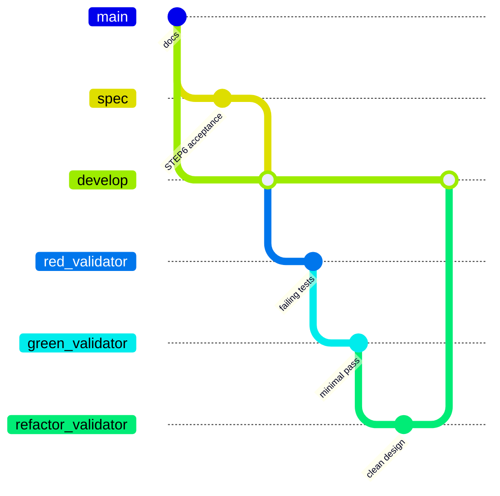
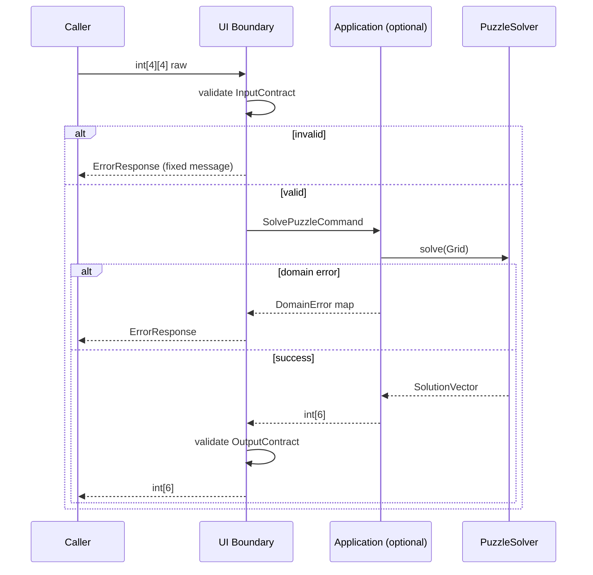

# 브랜치 전략에 대한 논의
_Exported on 5/28/2026 at 15:10:39 GMT+9 from Cursor (3.5.38)_

---

**User**

이 프로젝트에 대해 red, green 리팩토링 작업을 할건데 적당한 브랜치 전략을 알려줘

---

**Cursor**

프로젝트 구조와 Git 상태를 확인한 뒤, Red-Green 리팩토링에 맞는 브랜치 전략을 제안하겠습니다.


프로젝트는 **문제 정의만 완료**된 상태이고, Git에는 이미 `main` / `develop`이 있으며 현재 `develop`에 있습니다. README에 적힌 대로 **판정 → 생성 → 표현** 순 TDD와 Red-Green-Refactor 사이클에 맞춘 브랜치 전략을 제안합니다.

---

## 권장: Git-flow Lite + TDD 커밋 리듬

Red/Green/Refactor는 **브랜치 3개**가 아니라 **한 feature 브랜치 안의 커밋 순서**로 두는 것이 일반적입니다. 브랜치는 **기능 단위(수직 슬라이스)** 로 나눕니다.

```
main          ─── 문서 마일스톤, 릴리스 가능한 스냅샷
  │
develop       ─── 통합·항상 빌드/테스트 통과 목표
  │
  ├── feature/step6-acceptance
  ├── feature/validator-structure      (I-1~I-4)
  ├── feature/validator-line-sums      (I-5~I-7)
  ├── feature/validator-partial        (I-11, 선택)
  ├── feature/generator-complete
  └── feature/presentation-cli         (표현, 나중)
```

| 브랜치 | 역할 |
|--------|------|
| **main** | STEP 완료·문서만 반영된 안정 지점. 구현이 쌓이면 “동작하는 판정기 v1” 등 태그 |
| **develop** | 모든 feature 병합. 테스트 전체가 녹색인 상태 유지 |
| **feature/\*** | 하나의 수용 기준·불변식 묶음. `develop`에서 분기 → PR/merge → 삭제 |

이미 `develop`이 있으므로 **구현·TDD는 전부 `develop` 기준 feature 브랜치**로 가면 됩니다.

---

## Feature 브랜치 나누는 기준 (이 프로젝트에 맞춤)

README의 **검증 → 생성 → 표현**과 Invariant를 기준으로 쪼갭니다.

| 순서 | 브랜치 예시 | Red-Green 대상 |
|------|-------------|----------------|
| 0 | `docs/step6-acceptance` | 수용 기준 문장·예시 (코드 없음, `develop` 병합) |
| 1 | `feature/grid-model` | 4×4 격자 표현, I-1 |
| 2 | `feature/validator-uniqueness` | 1~16 각 1회, I-3·I-4 |
| 3 | `feature/validator-sums` | 행·열·대각 합, I-5~I-8 |
| 4 | `feature/validator-partial` | 부분 배치, I-11 (선택) |
| 5 | `feature/generator-known` | 완전 배치 제공 + 판정기 재확인, I-10 |
| 6 | `feature/cli-or-format` | 입출력·표현 |

**한 브랜치 = 한 번에 리뷰·되돌리기 가능한 크기** (보통 30분~반나절 TDD). 너무 크면 Red가 여러 요구를 섞어 실패 원인이 흐려집니다.

---

## Red / Green / Refactor는 브랜치가 아니라 커밋

한 `feature/validator-sums` 안에서:

```
1. RED      test: 행 합이 34가 아니면 invalid
2. GREEN    feat: 행 합만 검사하는 최소 구현
3. REFACTOR refactor: 합 계산을 공통 함수로 추출 (테스트 녹색 유지)
4. RED      test: 열 합 동일
5. GREEN    ...
```

커밋 메시지 접두어 예: `test:`(Red), `feat:`(Green), `refactor:`(Refactor).

- **Red 커밋만 push**해도 CI가 실패하는 것은 정상(교육·데모용).
- 팀/혼자 작업이면 **Green까지 한 뒤 push**하는 편이 `develop` 보호에 유리합니다.

Refactor 전용 브랜치(`refactor/extract-sum`)는 **Green이 이미 있고**, 리팩터 범위가 클 때만 짧게 씁니다. 일상적인 Extract Method는 feature 브랜치 안 커밋으로 충분합니다.

---

## 병합 규칙 (develop / main)

| 규칙 | 내용 |
|------|------|
| feature → **develop** | 해당 feature 테스트 전부 통과 후 merge (squash 또는 merge commit 중 하나로 통일) |
| develop → **main** | STEP·마일스톤 단위 (예: “판정기 v1”, “STEP6 문서”) |
| develop 직접 커밋 | 긴급 문서·README만; 구현 TDD는 feature 경유 권장 |

교육·1인 프로젝트면 PR 없이 `git merge feature/xxx`만 해도 되고, **브랜치 이름·커밋 접두어 규칙**만 지키면 Red-Green 이력이 남습니다.

---

## 피하는 패턴

| 패턴 | 이유 |
|------|------|
| `red/...`, `green/...` 브랜치를 매 사이클마다 생성 | 브랜치 폭발, merge 비용만 증가 |
| `feature/magic-square-all` 하나에 판정+생성+UI | Red 실패 시 원인 분리 어려움 |
| Refactor를 main에 바로 | develop 없이 가면 TDD·통합 흐름이 깨짐 |

---

## 시작 시 실행 예 (현재 `develop` 기준)

```powershell
git checkout develop
git pull   # 원격 있을 때

git checkout -b docs/step6-acceptance
# STEP 6 수용 기준 작성 후 develop 병합

git checkout develop
git checkout -b feature/validator-structure
# Red → Green → Refactor 반복
git checkout develop
git merge feature/validator-structure
```

---

## 요약

- **브랜치**: `main`(안정) / `develop`(통합) / `feature/<도메인-기능>`(짧게, 불변식·수용 기준 단위).
- **Red-Green-Refactor**: 같은 feature 브랜치의 **연속 커밋**으로 표현.
- **순서**: STEP6 문서 → 격자·집합 검증 → 합 검증 → (선택) 부분 배치 → 생성 → 표현.

원하시면 STEP 6 수용 기준 초안에 맞춰 `feature/*` 브랜치 이름 목록을 더 촘촘히 잘라 드리겠습니다.

---

**User**

develop 브랜치에서 red, green 리팩토링 브랜치를 생성하는 전략으로 진행할거다. 검토해주고 괜찮으면 develop 브랜치에서 spec 브랜치 먼저 만들어

---

**Cursor**

Red/Green/Refactor 브랜치 전략을 검토한 뒤, 괜찮으면 `develop`에서 `spec` 브랜치를 생성합니다.


## 전략 검토

`develop`을 통합 기준으로 두고, **Red → Green → Refactor**를 각각 브랜치로 나누는 방식은 **교육·이력 가시화**에는 잘 맞습니다. 다만 아래 규칙을 지키지 않으면 브랜치가 빠르게 늘고 `develop`이 깨지기 쉽습니다.

### 괜찮은 점

| 항목 | 이유 |
|------|------|
| `develop` 고정 | 통합·안정 기준점이 분명함 |
| `spec` 선행 | STEP 6 수용 기준을 코드보다 먼저 고정 — TDD와 README 방향과 일치 |
| 단계별 브랜치 | Red/Green/Refactor 단계를 Git 히스토리로 남기기 좋음 |

### 주의할 점 (반드시 규칙으로 고정)

1. **한 기능 단위마다 Red→Green→Refactor 세트**  
   저장소 전체에 `red` 하나, `green` 하나만 두지 말고, 예: `red/validator-row-sum` → `green/validator-row-sum` → `refactor/validator-row-sum` 처럼 **슬라이스별**로 만듭니다.

2. **병합 방향은 항상 한 방향**  
   ```
   develop → red/... → green/... → refactor/... → develop
   ```  
   `green`에서 `red`로 역병합하거나, `refactor` 없이 `develop`에 Red만 넣지 않습니다.

3. **develop에는 “테스트 전부 통과”만**  
   Red 브랜치는 의도적으로 실패할 수 있지만, **`develop` 병합 시점에는 Green 이후(또는 Refactor 완료 후)** 만 허용하는 것이 안전합니다.

4. **`spec`은 구현 브랜치와 분리**  
   수용 기준·예시·계약 문서만. Red/Green은 `spec`이 `develop`에 병합된 뒤(또는 해당 슬라이스 spec이 확정된 뒤) 시작하는 편이 좋습니다.

### 권장 브랜치 흐름



### 이름 규칙 예시

| 단계 | 패턴 | 예 |
|------|------|-----|
| 명세 | `spec` | (현재 브랜치) |
| 실패 테스트 | `red/<슬라이스>` | `red/validator-sums` |
| 최소 구현 | `green/<슬라이스>` | `green/validator-sums` |
| 구조 개선 | `refactor/<슬라이스>` | `refactor/validator-sums` |

**결론:** 진행해도 됩니다. 위 네 가지 규칙만 지키면 Red/Green/Refactor 브랜치 전략으로도 깔끔하게 운영할 수 있습니다.

---

## `spec` 브랜치 생성 완료

`develop`(커밋 `f3cedc4`)에서 `spec` 브랜치를 만들었고, 현재 체크아웃된 브랜치입니다.

```
* spec    f3cedc4  ← 현재
  develop f3cedc4
  main    f3cedc4
```

다음 작업은 `spec`에서 STEP 6 수용 기준(검증 가능한 요구, 통과/실패 예시)을 정리한 뒤 `develop`으로 병합하는 흐름이 자연스럽습니다. 원격이 있다면 첫 push 시:

```powershell
git push -u origin spec
```

---

**User**

너는 Cursor.AI용 프롬프트 설계자다.
나는 Magic Square 4x4 TDD 설계 문서를 만들기 위한 프롬프트가 필요하다.
지금 설계 문서를 만들지 말고,그 설계 문서를 만들 수 있는 실행용 프롬프트만 작성하라.


---

**Cursor**

프로젝트 맥락을 반영해 실행용 프롬프트만 작성합니다. 기존 문제 정의 문서를 확인합니다.


아래는 **설계 문서 본문을 쓰지 않고**, Cursor에 붙여 넣어 **TDD 설계 문서를 생성시키기 위한 실행용 프롬프트**만 제공합니다. 프로젝트의 `README.md`, `Report/01.문제정의_보고서.md`, 브랜치 전략(`spec` → `red` → `green` → `refactor`)을 반영했습니다.

---

## 실행용 프롬프트 (복사하여 사용)

```markdown
# 역할

당신은 **4×4 Magic Square TDD 설계 문서 작성자**입니다.
나는 SW 아키텍트이며, 교육·실습 프로젝트 `MagicSquare_xx`를 진행 중입니다.

**지금 할 일:** TDD 기반 **설계 문서 1부**를 작성한다.
**지금 하지 말 것:** 소스 코드 작성, 테스트 코드 작성, 프레임워크·언어 선정의 최종 확정, UI/CLI 구현, 알고리즘 상세 구현, n×n 일반화 설계.

---

# 필수 입력 (반드시 먼저 읽을 것)

워크스페이스에서 아래 파일을 읽고, 설계 문서의 **유일한 도메인·불변식·범위 근거**로 삼아라. 읽기 전에는 추측으로 Invariant를 바꾸지 마라.

- `@README.md`
- `@Report/01.문제정의_보고서.md`

(선택 참고: `@Prompt/01.cursor_4x4_magic_square_problem_definit.md` — 용어·Why 맥락 정렬용)

---

# 프로젝트 맥락 (고정 전제)

| 항목 | 내용 |
|------|------|
| 도메인 | 4×4 표준 마방진: 1~16 각 1회, 행·열·주대각·부대각 합 동일(34) |
| 진짜 문제 | 규칙 명시 + 일관 판정 + 완전 배치의 판정기 재확인(I-10) |
| 구현 순서 원칙 | **검증(판정) → 생성(배치 획득) → 표현** — 생성은 검증의 부분집합으로 다룸 |
| Git 브랜치 전략 | `develop` 통합 기준 → `spec` → `red/<슬라이스>` → `green/<슬라이스>` → `refactor/<슬라이스>` → `develop` |
| 현재 단계 | 문제 정의(STEP 1~5) 완료. **STEP 6(수용 기준) + TDD 설계**를 본 문서에서 다룸 |

---

# 산출물

## 파일

- 경로: `Report/02.TDD_설계_문서.md`
- 언어: 한국어
- 형식: Markdown (표·목차·코드 블록 적극 사용)

## 문서 성격

- **설계·계약·테스트 전략** 문서이지, 구현 매뉴얼이 아님
- 모든 요구는 **검증 가능**해야 함 (모호한 “잘 동작한다” 금지)
- Invariant ID(I-1 ~ I-11)를 설계 전반에서 **추적 가능**하게 매핑할 것

---

# 작성 절차 (이 순서를 따를 것)

1. 문제 정의 보고서에서 **진짜 문제 정의·Invariant·신뢰 원칙(I-10)** 을 1페이지 이내로 재정리(복사가 아닌 설계 관점 재서술)
2. **STEP 6 — Acceptance framing** 작성: 통과/실패/경계 수용 예시(격자는 표 또는 4×4 배열 리터럴로 명시)
3. **Bounded Context·책임 경계** 정의: 판정(Validator) / 배치 획득(Generator·Provider) / 표현(Presentation) — 각각 입력·출력·금지 사항
4. **도메인 모델(개념)** 정의: Grid, Cell, PlacementState(완전/부분), Verdict 등 — 구현 클래스명이 아닌 **개념과 계약**
5. **TDD 슬라이스 계획** 작성: Invariant·수용 기준 단위로 Red→Green→Refactor 사이클을 나눔
6. **브랜치 매핑 표** 작성: 각 슬라이스별 `red/...`, `green/...`, `refactor/...` 제안 이름 + 병합 조건
7. **테스트 전략** 작성: 단위/통합 경계, 픽스처·예시 격자, 결정성(I-9) 검증 방법
8. **비포함·가정·리스크** 명시

각 절을 쓸 때마다, 해당 절이 **어느 Invariant·어느 수용 기준**을 다루는지 표로 연결하라.

---

# 필수 목차 (이 순서·제목 유지)

1. 문서 개요 (목적, 독자, 범위, 참조 문서)
2. 문제 정의 요약 (표면 vs 진짜, 한 줄 성공 기준)
3. Invariant 추적 매트릭스 (I-1~I-11 ↔ 설계 요소 ↔ 테스트 슬라이스)
4. STEP 6 — 수용 기준 (Acceptance Criteria)
   - 4.1 검증 가능한 요구 문장 (SHALL/SHOULD 구분)
   - 4.2 통과 예시 (최소 3건: 완전 유효, 완전 무효, 부분 배치(I-11 선택 시))
   - 4.3 실패·경계 예시 (중복 값, 범위 밖, 합 불일치, 크기 오류 등)
   - 4.4 판정 결과 계약 (Valid / Invalid / Incomplete 등 — 의미 정의)
5. 아키텍처 경계 (판정 · 획득 · 표현)
6. 도메인 모델 및 계약 (개념 수준)
7. TDD 슬라이스 로드맵 (권장 구현·테스트 순서)
8. Red / Green / Refactor 사이클 명세 (슬라이스별)
9. Git 브랜치 전략과 슬라이스 매핑
10. 테스트 데이터·픽스처 전략
11. 비포함 범위 (UI 상세, n×n, 전체 해 탐색, 성능 등)
12. 가정·미결정 사항 (의도적으로 열어 둔 결정 + 결정 시점 제안)
13. 다음 단계 (첫 Red 브랜치에서 할 일 3줄 이내)
14. 문서 이력 (버전, 일자, 변경 요약)

---

# TDD 슬라이스 분할 규칙 (반드시 준수)

- 한 슬라이스 = **하나의 실패 이유**를 Red에서 드러낼 수 있을 만큼 작게
- 권장 1차 슬라이스 순서 (변경 시 근거를 문서에 명시):
  1. 격자 구조·완전성 (I-1, I-2)
  2. 값 범위·중복 없음 (I-3, I-4)
  3. 행 합 (I-5, I-8 일부)
  4. 열 합 (I-6)
  5. 대각 합 (I-7)
  6. 결정성·재현성 (I-9)
  7. 완전 배치 제공 ↔ 판정기 일치 (I-10)
  8. (선택) 부분 배치 조기 위반 (I-11)
  9. 표현(최소 출력 계약만)
- **생성/알고리즘 슬라이스는 판정 슬라이스가 Green된 이후**에만 로드맵에 넣을 것
- 각 슬라이스마다 아래 3블록을 **반드시** 작성:
  - **Red:** 어떤 테스트(또는 수용 예시)가 왜 실패해야 하는지
  - **Green:** 통과를 위한 최소 책임(구현 힌트 수준, 코드 없음)
  - **Refactor:** 구조 개선 방향(동작 불변 전제)

---

# Git 브랜치 명세 (문서에 포함할 내용)

다음 규칙을 문서 §9에 명문화하라:

| 규칙 | 내용 |
|------|------|
| 기준 브랜치 | `develop` |
| 명세 브랜치 | `spec` — 본 설계 문서·수용 기준 확정 |
| 사이클 브랜치 | `red/<슬라이스>`, `green/<슬라이스>`, `refactor/<슬라이스>` |
| 병합 방향 | red → green → refactor → develop (역방향 금지) |
| develop 병합 조건 | 해당 슬라이스 Refactor 완료·관련 수용 기준 충족 |

슬라이스마다 **제안 브랜치 이름 예시**를 표로 제시하라.

---

# 품질 기준 (자기 검수 후 제출)

문서 제출 전, 아래를 스스로 점검하고 §13 또는 부록에 **체크리스트 결과(통과/미통과)** 를 간단히 남겨라.

- [ ] 표면 정의(“마방진 완성 프로그램”)에 끌려가지 않고 진짜 정의가 주도하는가?
- [ ] I-1~I-10이 최소 1회씩 수용 기준 또는 슬라이스에 매핑되는가?
- [ ] I-11은 포함 여부를 명시하고, 포함 시에만 슬라이스가 있는가?
- [ ] “제공한 완전 배치 = 판정기 통과”(I-10)가 Generator·Validator 경계에 반영되는가?
- [ ] 통과/실패 예시에 **구체적 4×4 숫자 배열**이 있는가?
- [ ] 구현 코드·특정 언어 문법이 본문에 없는가?
- [ ] Red/Green/Refactor가 **슬라이스별**로 구분되어 있는가?
- [ ] n×n, UI 상세, 성능 최적화가 비포함으로 명시되는가?

미통과 항목이 있으면 수정 후 다시 제출하라.

---

# 출력 형식

1. 먼저 **한 단락 요약**(설계 문서의 핵심 5줄 이내)을 출력하라.
2. 이어서 `Report/02.TDD_설계_문서.md` **전체 본문**을 작성하라.
3. 마지막에 **다음 액션 3가지**(사람이 할 일: 예 — spec 브랜치 커밋, 첫 red 브랜치 생성 등)만 bullet으로 제시하라.

---

# 금지 사항

- 문제 정의 보고서에 없는 규칙을 임의 추가하지 마라 (예: 0 허용, 5×5, 마방 상수 65)
- 설계 문서 없이 “바로 구현하겠다”고 제안하지 마라
- 알고리즘 의사코드·실제 테스트 코드·프로덕션 코드를 작성하지 마라
- “적당히”, “충분히”, “유연하게” 같은 비검증 표현만으로 요구를 끝내지 마라

---

# 시작

위 지시를 모두 이해했다면, **입력 파일을 읽은 뒤** `Report/02.TDD_설계_문서.md` 설계 문서 작성을 시작하라.
```

---

## 사용 방법

1. Cursor에서 `spec` 브랜치에 있는 상태로 위 프롬프트를 새 채팅에 붙여 넣습니다.
2. `@README.md`, `@Report/01.문제정의_보고서.md`가 프롬프트 안에 있으므로, 해당 파일들이 워크스페이스에 열려 있으면 인용이 잘 됩니다.
3. 생성된 `Report/02.TDD_설계_문서.md`를 검토한 뒤 `spec`에 커밋하면 됩니다.

원하시면 이 프롬프트를 `Prompt/02.cursor_4x4_tdd_design_document.md`로 저장하는 작업도 해 드릴 수 있습니다.

---

**User**

당신은 Dual-Track UI + Logic TDD 및 Clean Architecture 설계 전문가입니다.
프로젝트: Magic Square (4x4) — TDD 연습용
목적: 알고리즘 난이도보다 “레이어 분리 + 계약 기반 테스트 + 리팩토링” 훈련
제약:
- 구현 코드는 작성하지 마십시오. (설계/계약/테스트/통합 계획만)
- UI는 실제 화면이 아니라 “입력/출력 경계(Boundary)”로 정의
- Data Layer는 DB가 아니라 “저장/로드 인터페이스(메모리/파일 교체 가능)” 수준만
- 입력/출력은 명확히 고정
입력 계약:
- 4x4 int[][] (0은 빈칸)
- 빈칸은 정확히 2개
- 값 범위: 0 또는 1~16
- 0 제외 중복 금지
출력 계약:
- int[6]
- 좌표는 1-index
- 반환 형식: [r1,c1,n1,r2,c2,n2]
- n1,n2는 두 누락 숫자이며, (작은수→첫빈칸, 큰수→둘째빈칸) 조합이 마방진이면 그 순서로, 아니면 반대로

------------------------------------------------------------
출력 형식 (반드시 이 구조로)
------------------------------------------------------------
# 1) Logic Layer (Domain Layer) 설계
## 1.1 도메인 개념
- Entities / Value Objects / Domain Services 목록과 책임(SRP)
## 1.2 도메인 불변조건(Invariants)
- 행/열/대각선 합 일치, Magic Constant 등
## 1.3 핵심 유스케이스(도메인 관점)
- 빈칸 찾기, 누락 숫자 찾기, 마방진 판정, 두 조합 시도
## 1.4 Domain API(내부 계약)
- 메서드 시그니처 수준(코드 X) + 입력/출력/실패조건
## 1.5 Domain 단위 테스트 설계(RED 우선)
- 테스트 케이스 목록(정상/비정상/엣지)
- 각 테스트가 보호하는 invariant 명시

# 2) Screen Layer (UI Layer) 설계 (Boundary Layer)
## 2.1 사용자/호출자 관점 시나리오
- “행렬 입력 → 검증 → 결과 출력” 흐름
## 2.2 UI 계약(외부 계약)
- Input schema / Output schema / Error schema
## 2.3 UI 레벨 테스트(Contract-first, RED 우선)
- 잘못된 크기, 빈칸 개수 오류, 값 범위 오류, 중복 오류, 반환 포맷 검증
- Domain은 Mock으로 가정
## 2.4 UX/출력 규칙
- 에러 메시지 표준(정확한 문구 규칙까지)
# 3) Data Layer 설계 (Data Layer)
## 3.1 목적 정의
- “저장/로드”의 필요성과 범위(학습용)
## 3.2 인터페이스 계약
- 예: MatrixRepository.save/load (메서드 수준, 코드 X)
- 저장 대상: 입력 행렬, 실행 결과(선택)
## 3.3 구현 옵션 비교(메모리/파일)
- 옵션 A: InMemory / 옵션 B: File(JSON/CSV)
- 추천안 1개 선택 + 이유
## 3.4 Data 레이어 테스트
- 저장/로드 정합성, 예외(파일 없음/형식 오류), 불변조건(4x4 유지)

# 4) Integration & Verification (통합 및 검증)
## 4.1 통합 경로 정의
- UI → Application(선택) → Domain → Data 흐름(의존성 방향 포함)
## 4.2 통합 테스트 시나리오
- 정상 시나리오 2개 이상
- 실패 시나리오 3개 이상(입력 오류, 도메인 실패, 데이터 실패)
## 4.3 회귀 보호 규칙
- 기존 테스트 유지 정책
- 변경 금지 규칙(계약/출력 포맷)
## 4.4 커버리지 목표
- Domain Logic 95%+
- UI Boundary 85%+
- Data 80%+
## 4.5 Traceability Matrix (필수)
- Concept(Invariant) → Rule → Use Case → Contract → Test → Component

------------------------------------------------------------
추가 조건
------------------------------------------------------------
- 모호한 표현 금지(“적절히/충분히” 금지)
- 모든 규칙은 검증 가능해야 함(테스트로 확인 가능)
- 구현 코드 작성 금지
- 표/체크리스트를 적극 사용


---

**Cursor**

요청하신 구조와 입·출력 계약에 맞춰 설계 문서만 작성합니다. 구현 코드는 포함하지 않습니다.


# Magic Square 4×4 — Dual-Track UI + Logic TDD · Clean Architecture 설계

**프로젝트:** Magic Square (4×4) TDD 연습  
**목적:** 알고리즘 난이도보다 레이어 분리 · 계약 기반 테스트 · 리팩토링 훈련  
**범위:** 설계 · 계약 · 테스트 · 통합 계획만 (구현 코드 없음)

---

## 고정 계약 요약

| 구분 | 규칙 |
|------|------|
| **입력** | `int[4][4]`, `0` = 빈칸, 빈칸 **정확히 2개**, 값 ∈ `{0} ∪ [1,16]`, `0` 제외 값 **중복 금지** |
| **빈칸 순서** | **행 우선(row-major)**, 1-index: `(r,c)`에서 `r` 1→4, `c` 1→4 스캔 시 **첫 번째 `0`** = 1번 빈칸, **두 번째 `0`** = 2번 빈칸 |
| **출력** | `int[6]` = `[r1,c1,n1,r2,c2,n2]`, 좌표·숫자 모두 **1-index 좌표**, `n1`→1번 빈칸, `n2`→2번 빈칸 |
| **배치 규칙** | 누락 수 `m1 < m2` (1~16 중 미출현 2개). **시도 A:** `m1`→1번 빈칸, `m2`→2번 빈칸 → 마방진이면 `[r1,c1,m1,r2,c2,m2]`. **아니면 시도 B:** `m2`→1번, `m1`→2번 → `[r1,c1,m2,r2,c2,m1]` |
| **Magic Constant** | `M = 34` (1~16 완전 배치 시 행·열·주대각·부대각 합) |

---

# 1) Logic Layer (Domain Layer) 설계

## 1.1 도메인 개념

| 분류 | 이름 | 책임 (SRP) |
|------|------|------------|
| **Entity** | `Grid` | 4×4 셀 집합 보유. 불변 스냅샷 생성·완성 격자 조회. 자체 검증 로직 없음. |
| **Value Object** | `CellPosition` | `(row, col)` 1-index, 1≤row,col≤4, 동등성·순서 비교. |
| **Value Object** | `CellValue` | `0`(빈칸) 또는 `1..16`. 범위 위반 시 생성 거부(도메인 팩토리). |
| **Value Object** | `EmptySlotPair` | 행 우선으로 찾은 **1번·2번 빈칸** 좌표 쌍. 순서 변경 불가. |
| **Value Object** | `MissingPair` | `m1 < m2`, 집합 `{1..16} \ grid의 비零 값}`에서 유도. |
| **Value Object** | `MagicConstant` | 상수 `34` 캡슐화. 합 비교 시 단일 출처. |
| **Value Object** | `SolutionVector` | `[r1,c1,n1,r2,c2,n2]` 6원 정수, 좌표·값 범위 검증. |
| **Value Object** | `DomainError` | 코드 + 메시지(도메인 실패 전용). |
| **Domain Service** | `EmptyCellLocator` | `Grid`에서 `0` 위치 2개를 행 우선으로 탐색 → `EmptySlotPair`. |
| **Domain Service** | `MissingNumberFinder` | 비零 값으로 `MissingPair` 계산. |
| **Domain Service** | `MagicSquareValidator` | **완전 채워진** 4×4에 대해 I-D1~I-D7 판정(아래). |
| **Domain Service** | `PuzzleSolver` | 시도 A/B 수행 후 `SolutionVector` 또는 `DomainError` 반환. |

**레이어 금지:** Domain은 입출력 포맷 파싱, 파일, 콘솔, 에러 문구( UI 문구)를 알지 않음.

---

## 1.2 도메인 불변조건(Invariants)

| ID | 불변 조건 | 검증 시점 |
|----|-----------|-----------|
| I-D1 | 격자 크기 = 4×4 | `Grid` 생성 시 |
| I-D2 | 완전 격자: 모든 칸 ∈ [1,16] | `MagicSquareValidator` |
| I-D3 | 완전 격자: 1~16 각 정확히 1회 | `MagicSquareValidator` |
| I-D4 | 네 행 합 = `M`(34) | `MagicSquareValidator` |
| I-D5 | 네 열 합 = `M` | `MagicSquareValidator` |
| I-D6 | 주대각 합 = `M` | `MagicSquareValidator` |
| I-D7 | 부대각 합 = `M` | `MagicSquareValidator` |
| I-D8 | 퍼즐 입력: `0` 정확히 2개 | UI 계약 + Domain 재검증 권장 |
| I-D9 | 퍼즐 입력: 비零 값 중복 없음 | UI 계약 + Domain 재검증 권장 |
| I-D10 | `MissingPair`는 항상 2개, `m1 < m2` | `MissingNumberFinder` |
| I-D11 | `SolutionVector`의 `(r1,c1)`, `(r2,c2)`는 입력 빈칸 위치와 동일 | `PuzzleSolver` |
| I-D12 | 동일 완성 격자 → 동일 `SolutionVector` (결정적) | `PuzzleSolver` |

**부분 격자(퍼즐 입력):** I-D4~I-D7은 **두 수를 채운 완성 격자**에만 적용. 기입된 14칸만으로 행·열 합이 이미 `M` 초과면 시도 A/B 모두 실패 → `NO_VALID_COMPLETION`.

---

## 1.3 핵심 유스케이스(도메인 관점)

| UC-ID | 이름 | 전제 | 주요 단계 | 성공 | 실패 |
|-------|------|------|-----------|------|------|
| UC-D1 | 빈칸 찾기 | I-D8 | 행 우선 스캔 → 2좌표 | `EmptySlotPair` | `0` 개수 ≠ 2 |
| UC-D2 | 누락 숫자 찾기 | 14개 비零, I-D9 | `{1..16}\values` → 정렬 | `MissingPair(m1,m2)` | 누락 수 ≠ 2 |
| UC-D3 | 마방진 판정 | 완전 4×4 | I-D2~I-D7 검사 | `true` / `false` | — |
| UC-D4 | 두 조합 시도·해 도출 | UC-D1,D2 성공 | 완성 격자 A 생성 → UC-D3; 실패 시 B | `SolutionVector` | 둘 다 false → `NO_VALID_COMPLETION` |
| UC-D5 | 퍼즐 일괄 해결 | 구조 검증된 `Grid` | D1→D2→D4 | `SolutionVector` | D1/D2/D4 실패 |

**시도 A/B 상세 (UC-D4):**

1. `(r1,c1)`, `(r2,c2)` = UC-D1 결과  
2. `(m1,m2)` = UC-D2, `m1 < m2`  
3. **A:** `r1,c1 ← m1`, `r2,c2 ← m2` → UC-D3 → true면 `[r1,c1,m1,r2,c2,m2]`  
4. **B:** `r1,c1 ← m2`, `r2,c2 ← m1` → UC-D3 → true면 `[r1,c1,m2,r2,c2,m1]`  
5. A·B 모두 false → `NO_VALID_COMPLETION`  
6. A·B 모두 true → **A 우선** (고정 규칙, I-D12)

---

## 1.4 Domain API(내부 계약)

메서드는 **시그니처 수준** 표기. 실제 코드 없음.

| API | 입력 | 출력 | 실패 조건 |
|-----|------|------|-----------|
| `Grid.of(int[4][4])` | 4×4 원시 배열 | `Grid` | 크기 ≠ 4×4 |
| `EmptyCellLocator.locate(Grid)` | `Grid` | `EmptySlotPair` | `count(0) ≠ 2` → `INVALID_EMPTY_COUNT` |
| `MissingNumberFinder.find(Grid)` | `Grid` | `MissingPair` | 누락 개수 ≠ 2 → `INVALID_MISSING_COUNT` |
| `MagicSquareValidator.isValid(Grid)` | 완전 `Grid` | `boolean` | — |
| `PuzzleSolver.solve(Grid)` | I-D8,D9 만족 `Grid` | `SolutionVector` | D1/D2 실패 또는 UC-D4 실패 → `DomainError` |
| `SolutionVector.toArray()` | — | `int[6]` | 내부 검증 실패 시 생성 불가 |

**`DomainError` 코드 (Domain 전용):**

| 코드 | 의미 |
|------|------|
| `INVALID_GRID_SIZE` | 4×4 아님 |
| `INVALID_EMPTY_COUNT` | 빈칸 수 ≠ 2 |
| `INVALID_MISSING_COUNT` | 1~16 중 채워야 할 수가 2개가 아님 |
| `NO_VALID_COMPLETION` | 시도 A·B 모두 마방진 아님 |

---

## 1.5 Domain 단위 테스트 설계(RED 우선)

### 1.5.1 정상 케이스

| Test-ID | 설명 | 입력 요약 | 기대 | 보호 Invariant |
|---------|------|-----------|------|----------------|
| D-T01 | 시도 A 성공 | 2빈칸, A만 유효 | `[r1,c1,m1,r2,c2,m2]` | I-D4~D7, I-D11 |
| D-T02 | 시도 B만 성공 | A 실패·B 성공 | `[r1,c1,m2,r2,c2,m1]` | I-D4~D7 |
| D-T03 | 빈칸 행 우선 순서 | (2,3),(3,1)에 0 | `r1,c1`=(2,3) | I-D11, 빈칸 순서 규칙 |
| D-T04 | Magic 34 검증 | 알려진 완성 4×4 | `isValid=true` | I-D4~D7 |
| D-T05 | 누락 수 계산 | 14개 채움 | `m1,m2` 고정 | I-D10 |

### 1.5.2 비정상·엣지

| Test-ID | 설명 | 기대 | 보호 Invariant |
|---------|------|------|----------------|
| D-T10 | 빈칸 1개 | `INVALID_EMPTY_COUNT` | I-D8 |
| D-T11 | 빈칸 3개 | `INVALID_EMPTY_COUNT` | I-D8 |
| D-T12 | 비零 중복 | (UI 전 또는 Domain) 실패 | I-D9 |
| D-T13 | A·B 모두 무효 | `NO_VALID_COMPLETION` | I-D4~D7 |
| D-T14 | A·B 모두 유효 | A 결과 반환 | I-D12 |
| D-T15 | 행 합 이미 35+ | `NO_VALID_COMPLETION` | I-D4 |
| D-T16 | `Grid` 3×4 | `INVALID_GRID_SIZE` | I-D1 |

### 1.5.3 RED 사이클 매핑 (Domain Track)

| 사이클 | RED (실패 테스트) | GREEN (최소) | REFACTOR |
|--------|-------------------|--------------|----------|
| R1 | D-T04 행 합만 | 행 합 검사 | `LineSumChecker` 추출 |
| R2 | D-T04 + 열·대각 | 전체 I-D4~D7 | `MagicSquareValidator` |
| R3 | D-T03 | `EmptyCellLocator` | — |
| R4 | D-T05 | `MissingNumberFinder` | — |
| R5 | D-T01,02 | `PuzzleSolver` | UC-D4 명시적 분리 |

---

# 2) Screen Layer (UI Layer) 설계 (Boundary Layer)

**정의:** UI = **입력/출력 경계**. 화면·위젯 없음. 호출자(테스트 하네스·CLI 어댑터)가 계약만 준수.

## 2.1 사용자/호출자 관점 시나리오



| Step | 행위 | 책임 레이어 |
|------|------|-------------|
| S1 | 원시 `int[4][4]` 수신 | Boundary |
| S2 | 입력 계약 검증 | Boundary |
| S3 | `Grid` 변환·`solve` 위임 | Application |
| S4 | `int[6]` 출력 계약 검증 | Boundary |
| S5 | 성공/실패 응답 반환 | Boundary |

---

## 2.2 UI 계약(외부 계약)

### Input schema

| 필드 | 타입 | 제약 | 위반 코드 |
|------|------|------|-----------|
| `grid` | `int[4][4]` | 행=4, 열=4 | `E_SIZE` |
| `grid[r][c]` | `int` | `0` 또는 `1..16` | `E_RANGE` |
| empty count | derived | `count(0) == 2` | `E_EMPTY_COUNT` |
| uniqueness | derived | 비零 값 집합 크기 = 비零 개수 | `E_DUPLICATE` |

**인덱스:** Boundary 내부는 0-index 배열 허용; **출력 좌표만 1-index**.

### Output schema (성공)

| 인덱스 | 이름 | 타입 | 제약 |
|--------|------|------|------|
| 0 | r1 | int | 1..4 |
| 1 | c1 | int | 1..4 |
| 2 | n1 | int | 1..16 |
| 3 | r2 | int | 1..4 |
| 4 | c2 | int | 1..4 |
| 5 | n2 | int | 1..16 |

추가 검증: `(r1,c1)≠(r2,c2)`, `{n1,n2}` = 누락 수 집합, 입력 `grid`의 0 위치와 좌표 일치.

### Error schema

| 필드 | 타입 | 설명 |
|------|------|------|
| `code` | `string` | 아래 표 코드 |
| `message` | `string` | **고정 문구**(변경 금지) |
| `httpStatus` | — | 사용 안 함 (로컬 경계) |

| code | message (정확히 일치) |
|------|------------------------|
| `E_SIZE` | `ERROR: Grid must be 4x4.` |
| `E_RANGE` | `ERROR: Cell value must be 0 or between 1 and 16.` |
| `E_EMPTY_COUNT` | `ERROR: Grid must contain exactly 2 empty cells (0).` |
| `E_DUPLICATE` | `ERROR: Non-zero cell values must be unique.` |
| `E_NO_SOLUTION` | `ERROR: No valid magic square completion exists.` |
| `E_OUTPUT_FORMAT` | `ERROR: Internal output contract violation.` |

`E_NO_SOLUTION` ← Domain `NO_VALID_COMPLETION` 매핑.

---

## 2.3 UI 레벨 테스트(Contract-first, RED 우선)

**전제:** `PuzzleSolver`(또는 Application 포트)는 **Mock**. Domain 로직은 UI 테스트에서 검증하지 않음.

| Test-ID | 시나리오 | Mock 설정 | 기대 |
|---------|----------|-----------|------|
| U-T01 | 3×4 입력 | 호출 없음 | `E_SIZE`, 메시지 일치 |
| U-T02 | 빈칸 1개 | 호출 없음 | `E_EMPTY_COUNT` |
| U-T03 | 값 17 | 호출 없음 | `E_RANGE` |
| U-T04 | 비零 5 중복 | 호출 없음 | `E_DUPLICATE` |
| U-T05 | 유효 입력 | `solve` → `[1,2,3,4,5,6]` | 배열 길이 6, Domain 1회 호출 |
| U-T06 | Domain 실패 | `NO_VALID_COMPLETION` | `E_NO_SOLUTION` |
| U-T07 | 출력 r1=0 | Mock 잘못된 벡터 | `E_OUTPUT_FORMAT` |
| U-T08 | 메시지 회귀 | 각 `E_*` | message 문자열 **완전 일치** |

### Dual-Track 분리

| Track | Mock | 검증 대상 |
|-------|------|-----------|
| **UI** | Domain Mock | 계약·메시지·호출 순서 |
| **Domain** | 없음 | I-D*, UC-D4 |

---

## 2.4 UX/출력 규칙

| 규칙 ID | 규칙 |
|---------|------|
| UX-1 | 성공 시 **반드시** `int[6]`만 반환(래퍼 없음). |
| UX-2 | 실패 시 **반드시** `ErrorResponse`; 성공 배열과 혼합 반환 금지. |
| UX-3 | 에러 메시지는 §2.2 표와 **바이트 단위 일치**(대소문자·구두점 포함). |
| UX-4 | 로그·디버그 출력은 Boundary 밖; 테스트는 public 계약만 검사. |
| UX-5 | 좌표는 항상 **1-index**; 0-index는 Boundary 내부 구현 세부사항. |

---

# 3) Data Layer 설계 (Data Layer)

## 3.1 목적 정의

| 항목 | 내용 |
|------|------|
| **목적** | 퍼즐 입력·실행 결과의 **저장/재로드**로 반복 학습·회귀 픽스처 재사용 |
| **범위** | 단일 4×4 행렬 + 선택적 `int[6]` 결과 메타 |
| **비목적** | DB, 동시성, 버전 마이그레이션, 원격 저장 |

---

## 3.2 인터페이스 계약

**포트 이름:** `MatrixRepository`

| 메서드 | 입력 | 출력 | 실패 |
|--------|------|------|------|
| `save(SnapshotId id, PersistedPuzzle data)` | `id`(비空 문자열), `data` | `void` | `STORAGE_WRITE_FAILED` |
| `load(SnapshotId id)` | `id` | `PersistedPuzzle` | `STORAGE_NOT_FOUND`, `STORAGE_CORRUPT` |
| `exists(SnapshotId id)` | `id` | `boolean` | — |
| `delete(SnapshotId id)` | `id` | `void` | `STORAGE_NOT_FOUND` |

**`PersistedPuzzle` 스키마 (논리):**

| 필드 | 타입 | 필수 |
|------|------|------|
| `grid` | `int[4][4]` | Y |
| `result` | `int[6]` \| null | N (미해결 시 null) |
| `savedAt` | ISO-8601 string | Y |

**불변:** load 후 `grid`는 항상 4×4; `result`가 non-null이면 길이=6.

---

## 3.3 구현 옵션 비교(메모리/파일)

| 항목 | 옵션 A: InMemory | 옵션 B: File (JSON) |
|------|------------------|---------------------|
| 저장소 | `Map<SnapshotId, PersistedPuzzle>` | `{baseDir}/{id}.json` |
| 영속 | 프로세스 종료 시 소실 | 디스크 유지 |
| 테스트 속도 | 최고 | 파일 I/O 필요 |
| 학습 포인트 | 인터페이스 치환 | 직렬화·예외 처리 |

**추천: 옵션 B (File JSON)**  
**이유:** (1) Repository 교체 연습에 실제 I/O 경계 필요, (2) 픽스처를 repo에 커밋해 통합 테스트 재현 가능, (3) InMemory는 단위 테스트 더블로 유지하고 프로덕션 어댑터만 File.

**파일 JSON 최소 스키마:**

```json
{
  "grid": [[...4 rows...]],
  "result": [r1,c1,n1,r2,c2,n2],
  "savedAt": "2026-05-28T12:00:00+09:00"
}
```

`result` 생략 또는 `null` 허용.

---

## 3.4 Data 레이어 테스트

| Test-ID | 시나리오 | 기대 | 보호 |
|---------|----------|------|------|
| DT-T01 | save → load | grid 동일 | 정합성 |
| DT-T02 | 존재하지 않는 id load | `STORAGE_NOT_FOUND` | 예외 계약 |
| DT-T03 | JSON 필드 누락 | `STORAGE_CORRUPT` | 형식 |
| DT-T04 | grid 3×3 in file | `STORAGE_CORRUPT` | 4×4 유지 |
| DT-T05 | result 길이 5 | `STORAGE_CORRUPT` | result 계약 |
| DT-T06 | delete 후 exists=false | — | lifecycle |

Data 테스트는 **InMemory 구현**으로 RED→GREEN 후, **File 구현**은 통합(§4)에서 2케이스.

---

# 4) Integration & Verification (통합 및 검증)

## 4.1 통합 경로 정의

**의존성 방향 (안쪽만 참조):**

```
[ Caller / Test Harness ]
        ↓
[ UI Boundary ]  →  Input/Output Contract
        ↓
[ Application Service ]  (선택, 권장)
        ↓
[ Domain: PuzzleSolver, Validator, ... ]
        ↑ (호출만, Domain은 Data 모름)
[ MatrixRepository ]  ←  Infrastructure (File / InMemory)
```

| 경로 | 설명 |
|------|------|
| **P1 해결 경로** | Boundary → App → Domain.solve → Boundary 출력 검증 |
| **P2 입력 거절** | Boundary 검증 실패 → Domain 미호출 |
| **P3 저장 경로** | Boundary/App → Repository.save (Domain 결과 후) |
| **P4 로드 후 해결** | Repository.load → Boundary → App → Domain |

**규칙:** Domain 패키지는 UI·Data import 금지. Data 구현체는 Domain 인터페이스에 의존하지 않음(독립 DTO).

---

## 4.2 통합 테스트 시나리오

### 정상 (≥2)

| IT-ID | 시나리오 | 검증 |
|-------|----------|------|
| IT-01 | 유효 퍼즐 E2E | `int[6]` 길이 6, 좌표 1-index, 완성 후 Domain validator=true |
| IT-02 | save → load → solve | load grid = save grid, 결과 동일 |
| IT-03 | 시도 B만 성공 퍼즐 | `n1 > n2` 가능(1번 빈칸에 큰 수) |

### 실패 (≥3)

| IT-ID | 시나리오 | 검증 |
|-------|----------|------|
| IT-F01 | 4×5 입력 | `E_SIZE`, Domain 미호출 |
| IT-F02 | 해 없는 퍼즐 | `E_NO_SOLUTION` |
| IT-F03 | corrupt JSON load | `STORAGE_CORRUPT`, solve 미실행 |
| IT-F04 | 빈칸 3개 | `E_EMPTY_COUNT` |
| IT-F05 | File id 없음 | `STORAGE_NOT_FOUND` |

---

## 4.3 회귀 보호 규칙

| 규칙 ID | 내용 |
|---------|------|
| REG-1 | `E_*` 메시지 문자열 변경 시 **UI 테스트 전부** 업데이트 + CHANGELOG 필수 |
| REG-2 | `int[6]` 순서·의미 변경 금지; 변경 시 Major 버전 + Traceability 전체 갱신 |
| REG-3 | Domain 테스트 D-T* 삭제 금지; 동작 변경 시 테스트 먼저 수정(RED) |
| REG-4 | Mock 기반 UI 테스트는 Domain 변경과 **독립** 실행 가능해야 함 |
| REG-5 | 통합 IT-*는 CI에서 Domain+UI+FileAdapter 최소 1세트 실행 |

---

## 4.4 커버리지 목표

| 레이어 | 목표 | 측정 범위 |
|--------|------|-----------|
| Domain Logic | **≥ 95%** branch | `EmptyCellLocator`, `MissingNumberFinder`, `MagicSquareValidator`, `PuzzleSolver` |
| UI Boundary | **≥ 85%** branch | 입력 검증, 에러 매핑, 출력 검증, Mock 호출 분기 |
| Data | **≥ 80%** branch | `save/load/exists/delete`, corrupt 경로 |

**미달 시:** 새 분기 테스트 추가; 커버리지만 올리는 무의미 assert 금지.

---

## 4.5 Traceability Matrix (필수)

| Concept (Invariant) | Rule | Use Case | Contract | Test | Component |
|---------------------|------|----------|----------|------|-----------|
| I-D8 빈칸 2개 | Input: count(0)=2 | UC-D1 | Input schema | U-T02, D-T10/11 | Boundary Validator |
| I-D9 비零 유일 | non-zero unique | — | Input schema | U-T04, D-T12 | Boundary Validator |
| 값 0\|1..16 | cell range | — | Input schema | U-T03 | Boundary Validator |
| 4×4 | rows=cols=4 | — | Input schema | U-T01, D-T16 | Boundary Validator |
| I-D10 m1<m2 | missing set | UC-D2 | — | D-T05 | MissingNumberFinder |
| 빈칸 순서 | row-major 1st/2nd | UC-D1 | Output coords | D-T03 | EmptyCellLocator |
| I-D4~D7 합=M | magic valid | UC-D3,D4 | — | D-T04,01,02 | MagicSquareValidator |
| 시도 A 우선 | A then B | UC-D4 | Output n1,n2 | D-T01,02,14 | PuzzleSolver |
| I-D12 결정성 | A wins if both | UC-D4 | — | D-T14 | PuzzleSolver |
| 좌표 1-index | external only | — | Output schema | U-T05,07 | Boundary |
| 출력 6원 | [r1,c1,n1,r2,c2,n2] | UC-D4 | Output schema | U-T05, IT-01 | Boundary |
| 해 없음 | — | UC-D4 | E_NO_SOLUTION | U-T06, IT-F02 | Boundary+Solver |
| 저장 4×4 | grid shape | — | PersistedPuzzle | DT-T04 | MatrixRepository |
| I-D11 좌표 일치 | slots fixed | UC-D4 | Output schema | IT-01 | PuzzleSolver |

---

## 부록 A) Application Layer (권장, 얇은 오케스트레이션)

| 책임 | 설명 |
|------|------|
| `SolvePuzzleUseCase` | `Grid.of` → `PuzzleSolver.solve` → DomainError를 Boundary 코드로 매핑 |
| 금지 | 행/열 합 계산, 빈칸 탐색 알고리즘 |

---

## 부록 B) Git 브랜치 ↔ Dual-Track 매핑

| 브랜치 | Track | 산출 |
|--------|-------|------|
| `spec` | — | 본 설계 문서 |
| `red/domain-line-sum` | Domain | D-T04 일부 RED |
| `green/domain-line-sum` | Domain | GREEN |
| `red/ui-empty-count` | UI | U-T02 RED (Domain Mock) |
| `green/ui-empty-count` | UI | GREEN |
| `refactor/domain-validator` | Domain | REFACTOR |
| `red/data-roundtrip` | Data | DT-T01 |

---

## 부록 C) 설계 자기검수 체크리스트

| # | 항목 | 결과 |
|---|------|------|
| 1 | 구현 코드 없음 | ✅ |
| 2 | 입출력 계약 고정·검증 가능 | ✅ |
| 3 | UI = Boundary, Domain Mock 분리 | ✅ |
| 4 | Data = Repository, DB 아님 | ✅ |
| 5 | Traceability Matrix 포함 | ✅ |
| 6 | 모호어(적절히/충분히) 없음 | ✅ |
| 7 | 에러 메시지 문구 고정 | ✅ |

---

**다음 액션 (구현 전):**  
1. `spec` 브랜치에 본 문서를 `Report/02.DualTrack_CleanArch_TDD_설계.md`로 저장  
2. Domain Track: `red/domain-empty-locator`에서 D-T03 RED 명세 확정  
3. UI Track: `red/ui-empty-count`에서 U-T02 RED 명세 확정 (Domain Mock 스텁 정의)

원하시면 이 내용을 `Report/` 및 `Prompt/` 파일로 저장하고 `spec` 브랜치에 커밋까지 진행하겠습니다.

---

**User**

spec 브랜치에 본 문서를 Report/02.DualTrack_CleanArch_TDD_설계.md로 저장

---

**Cursor**

`spec` 브랜치에 설계 문서 파일을 작성합니다.


`spec` 브랜치에 설계 문서를 저장했습니다.

| 항목 | 내용 |
|------|------|
| **경로** | `Report/02.DualTrack_CleanArch_TDD_설계.md` |
| **브랜치** | `spec` (현재 체크아웃) |
| **Git 상태** | untracked (아직 `git add` / 커밋 안 함) |

문서에는 Logic / UI(Boundary) / Data / Integration 4개 섹션, Traceability Matrix, Git 브랜치 매핑, 자기검수 체크리스트가 포함되어 있습니다.

커밋이 필요하면 말씀해 주세요. 예:

```powershell
git add Report/02.DualTrack_CleanArch_TDD_설계.md
git commit -m "Add Dual-Track Clean Architecture TDD design document."
```

